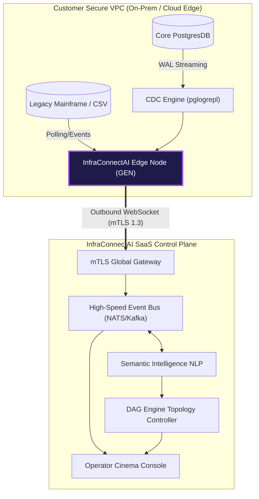
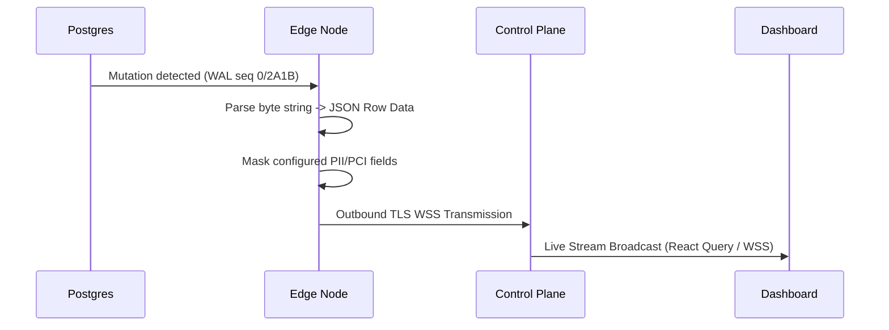

# InfraConnectAI: Complete Architecture Reference

InfraConnectAI is **The Infrastructure Connection Layer for AI-Native Systems**. Connect directly to your infrastructure—no APIs, no pipelines, no rebuilds. It is engineered specifically for zero-friction integration with legacy infrastructure (e.g., PostgreSQL, AS400). It transitions traditional data-engineering workflows into semantic, intent-driven operations managed by an AI orchestrator.

---

## 1. Top-Level Platform Topology

The core principle behind InfraConnectAI is pushing intelligence to the edge. Rather than exposing internal databases to the Internet, a lightweight agent resides inside the client's network and pushes logical changes outwards securely.

---

## 2. Component Teardown

### A. The Edge Agent Node (GEN)
**Path:** `services/edge-node/`
**Tech Stack:** Go 1.23, `pgxpool`, `gorilla/websocket`

The Edge Node is a highly parallelized, compiled Go binary designed for sub-50MB RAM footprints. 
- **Universal Connector Core:** Implements discrete connections for PostgreSQL and ODBC out of the box (`internal/connector/database.go`). It intelligently pools connections to prevent memory bloat.
- **CDC Streaming:** Subscribes to logical replication slots to intercept byte-level mutations (`INSERT/UPDATE/DELETE`) instantly, avoiding expensive sequential query loops (`internal/connector/cdc.go`).
- **Filesystem Sentinel:** Implements secure directory traversal and file-watch events for unstructured data streams (`internal/connector/filesystem.go`).
- **Security Posture:** Initiates *Outbound-only* persistent WebSockets, ensuring the network firewall remains entirely locked from inbound API traffic.

### B. The Semantic Intelligence Orchestrator 
**Path:** `src/lib/dag-engine.ts`, `src/components/ui/omnibar.tsx`
**Tech Stack:** React 18, `cmdk` (Command-K), Framer Motion, Regex/NLP Simulation 

InfraConnectAI replaces traditional Drag-and-Drop topology building with **Intent-Driven Engineering**:
- **The Omnibar:** A globally accessible, holographic command UI. Users tap `Cmd+K` anywhere.
- **DAG Engine (Directed Acyclic Graph):** Instantly parses natural language statements (e.g., *"Stream core payments to semantic index"*) into raw JSON topologies.
- **Auto-Routing:** The parsed intent determines the exact Source, Transform, and Destination nodes necessary, mathematically assigning XY coordinates to safely mount the pipeline directly onto the `React Flow` canvas.

### C. The Theatre (Enterprise Sales Console)
**Path:** `src/app/theatre/page.tsx`
**Tech Stack:** Next.js 16 (App Router), Tailwind CSS, Lucide React

Built strictly to close seven-figure deals, the Theatre isolates the underlying platform into a highly controlled, cinematic narrative. 
- **SOTA Animations:** Utilizes `<animateMotion>` across SVG `viewBox` coordinates to visually emulate latency, sluggish batch jobs, and dropped data connections.
- **Act 4 live-injection:** Pre-loads and simulates a live console environment that autonomously surfaces critical errors without requiring a brittle live database during a pitch.
- **Agent Ops (Act 5):** The "Multi-Task Agent Control." Provides pseudo-live RAM footprint logs, operational audit trails, and strict SECURE flags, actively calming CTO fears on security and cost.

---

## 3. Data Schema & Network Flow

**1. Discovery Flow:**
When the GEN is deployed (`install.sh`), it runs discovery protocols over local subnets on allowed ports (5432, 1433 etc). It maps table schemas and sends a JSON metadata payload up the mTLS tunnel to register the instance.

**2. Synchronous Mutation (CDC):**

**3. DAG Orchestration:**
The human operator enters natural intent -> AI DAG outputs Topology Payload -> React Flow renders visual representation -> Event Bus commands the GEN agent to begin listening to the selected Node bindings. All safely orchestrated, all immutable.
