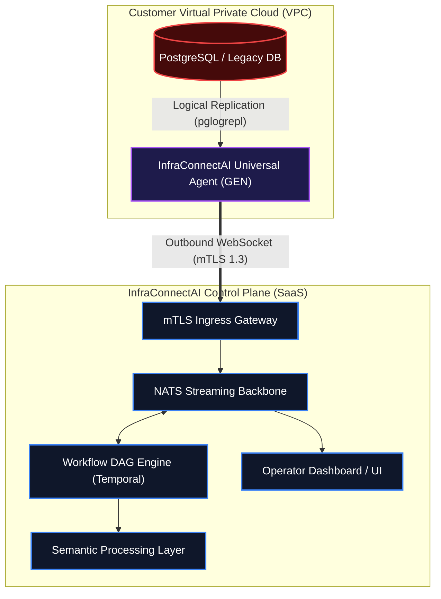

# InfraConnect AI Security Architecture

To successfully navigate Tier-1 enterprise procurement, you must present the underlying architecture in a way that immediately addresses the CISO's primary fear: **Inbound Firewall Risk**.

Below is the hardened data-flow topology.

### Enterprise Deployment Topology

### Security Posture Highlights

1. **Zero Inbound Ports**: The edge agent (GEN) reaches out to the InfraConnectAI Control Plane. You never open a port on your firewall, immediately bypassing 90% of traditional security objections.
2. **Mutual TLS (mTLS) Authentication**: Every tunnel is authenticated with unique cryptographic identities securely preventing Man-in-the-Middle (MitM) attacks.
3. **Data Anonymization at The Edge**: Because the agent executes on the client network, it can strip PII/PCI data *before* it ever leaves the VPC boundary.
4. **Agent Ephemerality**: If the agent is compromised, it has absolutely no access returning to the SaaS platform, isolating the blast radius entirely.
